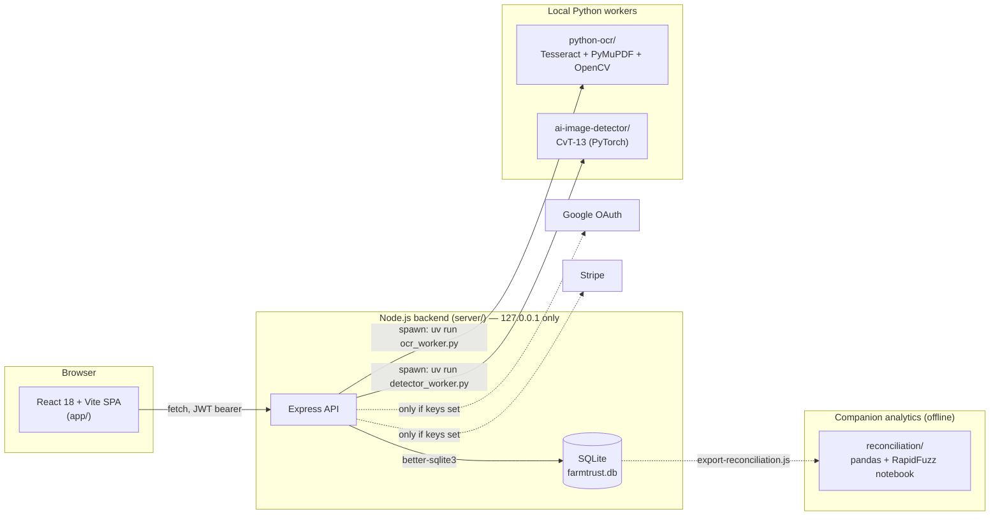
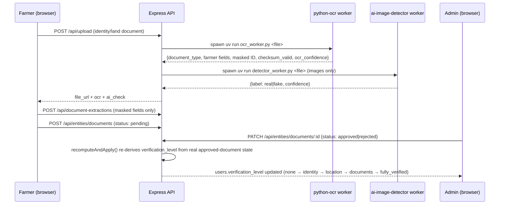

# FarmTrust

**A local-only, full-stack farmer-to-consumer marketplace that verifies who it's actually trusting.**

FarmTrust exists to answer one question a normal e-commerce marketplace never asks: *is the person selling this produce actually the farmer they claim to be, on land they actually hold?* Every farmer's identity documents and land papers are OCR'd, checksum-validated, and screened for AI-generated forgeries before an admin can mark them verified — and checkout is gated on that verification, not just on a listing existing. Everything else (catalog, cart, checkout, orders, reviews, market prices, multilingual UI) is built around that trust core.

It also runs **entirely on your machine** — no cloud database, no third-party auth provider, no payment processor required. The server binds to `127.0.0.1` only, the DB is a single SQLite file, uploads sit on local disk, and both AI pipelines (OCR + AI-image-detection) run as local subprocesses. The only things that ever reach the internet are things you explicitly opt into by adding keys: Google OAuth and real Stripe.

<!-- SCREENSHOT_PLACEHOLDER -->

---

## Table of contents

- [Why this exists](#why-this-exists)
- [Architecture](#architecture)
- [How verification actually works, end to end](#how-verification-actually-works-end-to-end)
- [How a purchase actually works, end to end](#how-a-purchase-actually-works-end-to-end)
- [Repository layout](#repository-layout)
- [Tech stack](#tech-stack)
- [Getting started](#getting-started)
- [Environment variables](#environment-variables)
- [API surface](#api-surface)
- [Data model](#data-model)
- [Privacy & security design](#privacy--security-design)
- [What's real vs. what's a local stand-in](#whats-real-vs-whats-a-local-stand-in)
- [How this was built](#how-this-was-built)
- [Design docs](#design-docs)
- [CI](#ci)
- [Roadmap](#roadmap)
- [License & attribution](#license--attribution)

---

## Why this exists

Direct-from-farmer marketplaces have a cold-start trust problem on both sides: a buyer has no way to know a "farmer" account is real, and a genuine farmer has no way to prove it beyond a photo and a claim. Centralized marketplaces solve this with manual KYC teams; a small/local project can't afford that, but it can automate the *evidence-gathering* so a human reviewer's decision is fast and well-informed instead of a rubber stamp.

FarmTrust's verification pipeline is that automation: OCR extracts and structures the fields on an uploaded identity/land document, a Verhoeff checksum validates Aadhaar numbers, a separate CvT-13 transformer flags document photos that look AI-generated, and a farm's declared area is cross-checked against the area calculated from the boundary polygon the farmer actually drew on a map. None of it auto-approves anything — every signal feeds an admin's decision, never replaces it (see [Privacy & security design](#privacy--security-design)).

## Architecture



Five independent pieces, each runnable and testable on its own:

| Piece | What it is |
|---|---|
| `server/` | Express + better-sqlite3 API — every entity, auth, permissions, the two AI-pipeline subprocess clients, market-price data, Stripe/mock-payment functions. |
| `app/` | React 18 + Vite SPA — public marketplace, farmer portal, admin portal, i18next multilingual UI (10 Indian languages). |
| `python-ocr/` | `uv`-managed OCR worker — land-document field extraction and a dedicated Aadhaar/Kisan-Card identity-document pipeline. |
| `ai-image-detector/` | `uv`-managed CvT-13 transformer worker that flags AI-generated document photos. |
| `reconciliation/` | Standalone pandas/RapidFuzz notebook that reconciles bank vs. ledger transactions — wired to FarmTrust's own orders via `export-reconciliation.js`, or runnable against its own 500-row synthetic dataset. |

The Node server never talks to the Python workers over HTTP — it `spawn()`s them as short-lived subprocesses per upload and reads a single JSON line back off stdout (everything else the worker prints is redirected to stderr, since a stray `print()` from a dependency would otherwise corrupt that contract — both workers enforce this explicitly).

## How verification actually works, end to end



`verification_level` is never a manual toggle sitting in isolation — [`server/src/verification/compute.js`](server/src/verification/compute.js) recomputes it from what's actually been approved every time a document is reviewed or a farm boundary changes:

- **identity** — an approved `identity_proof` document (Aadhaar / Kisan Card)
- **location** — the farmer's farm has a drawn boundary polygon
- **documents** — an approved `land_ownership` or `lease_tenancy` document
- **fully_verified** — all three at once

A farm's declared area vs. the area calculated from its drawn boundary is compared separately in [`areaMatch.js`](server/src/verification/areaMatch.js) (within 15% passes, 15–35% flags for review, beyond that fails) — a fully local stand-in for the satellite-imagery cross-check a paid third-party API would otherwise do.

## How a purchase actually works, end to end

1. Customer browses `/`, filtered/searched client-side against `GET /api/entities/products` (only `published`/`sold_out` rows are visible to non-owners — enforced server-side per-row, see [Data model](#data-model)).
2. `Checkout.jsx` groups the cart by farmer and creates one `Order` per farmer, then calls `POST /api/functions/createCheckoutSession`.
3. That route **first checks the farmer's `verification_level`** — an unverified farmer's orders are rejected with `reason: "farmer_unverified"` before any payment logic runs at all. This is the one place the whole verification pipeline actually bites.
4. No `STRIPE_SECRET_KEY` set (the default) → the order is marked `paid`/`accepted` immediately, no network call, and the customer is redirected straight to `/order-success?mock=1`. A real key set → an actual Stripe Checkout Session is created and `verifyPayment` polls it on the success page.
5. The farmer sees the order in `/farmer/orders`, can move it through `accepted → preparing → dispatched → delivered → completed`, and it shows up in `/farmer/earnings` and `/farmer/analytics`.
6. Optionally, `node server/scripts/export-reconciliation.js` turns every paid/refunded order into bank-statement + ledger CSV rows the `reconciliation/` notebook can reconcile — the same shape its own 500-row synthetic demo uses, just sourced from this app's real SQLite data instead.

## Repository layout

```text
farmtrust/
├── server/                  Express + better-sqlite3 backend (127.0.0.1 only)
│   ├── src/
│   │   ├── routes/          auth, generic entity CRUD+RLS, upload, functions (payments), market-prices, document-extractions
│   │   ├── verification/    verification_level derivation + declared/calculated area matching
│   │   ├── ocr/             subprocess clients for both Python workers
│   │   ├── market/          unit normalization + quarantine-on-invalid ingestion
│   │   └── db.js            schema, migrations, demo-data bootstrap
│   └── scripts/
│       └── export-reconciliation.js   FarmTrust orders → reconciliation/ CSV shape
├── app/                     React 18 + Vite SPA
│   └── src/
│       ├── pages/           public, farmer/*, admin/* route components (26 routes)
│       ├── components/      shared UI + shadcn/radix primitives
│       ├── lib/              AuthContext, cart, i18n language lists, format helpers
│       └── api/client.js    the entire backend contract, in one file
├── python-ocr/              uv-managed OCR worker (PyMuPDF + OpenCV + pytesseract)
│   ├── ocr/                 preprocessing, Tesseract invocation
│   ├── extraction/          document-type detection, Aadhaar (Verhoeff + masking), Kisan Card, land-document regex
│   ├── validation/          field-completeness + confidence scoring
│   └── models/              final JSON-shape assembly
├── ai-image-detector/       uv-managed CvT-13 AI-generated-image classifier
├── model/                   training notebook + (gitignored) trained checkpoint
├── reconciliation/          standalone pandas/RapidFuzz bank-vs-ledger reconciliation notebook
├── frontend-patch/          the two files that turned the original hosted-platform scaffold into this backend's client
├── docs/                    detailed page-by-page UX flow & direction specs written during design
└── .github/workflows/ci.yml lint + build (frontend), boot + health-check (backend), byte-compile (Python workers)
```

## Tech stack

| Layer | Stack |
|---|---|
| Frontend | React 18, Vite 6, Tailwind CSS, shadcn/ui (Radix primitives), React Router 6, TanStack Query, react-hook-form + zod, i18next (10 Indian languages), Recharts, Leaflet/OpenStreetMap |
| Backend | Node.js, Express 4, better-sqlite3 (SQLite, WAL mode), JWT (`jsonwebtoken`) + bcrypt, Passport Google OAuth2, Multer |
| OCR pipeline | Python, `uv`, Tesseract (`eng`+`hin`+`mar`), PyMuPDF, OpenCV |
| Fraud detection | Python, PyTorch, Hugging Face Transformers, CvT-13 (`microsoft/cvt-13`) |
| Reconciliation | Python, pandas, NumPy, RapidFuzz, Jupyter, Tableau |
| Tooling | ESLint 9, `uv` (Python env/dependency management), GitHub Actions |

Roughly 7.7k lines of frontend JS/JSX across 59 pages/components, 2k lines of backend JS, and 700 lines of Python across the two AI workers.

## Getting started

**Prerequisites:** Node.js 20+, Python 3.11+ with [`uv`](https://docs.astral.sh/uv/), and a Tesseract install that includes `eng`, `hin`, and `mar` language data (`tesseract --list-langs` to check).

### 1. Backend

```bash
cd server
cp .env.example .env        # fill in JWT_SECRET, TESSDATA_PREFIX, etc. — see below
npm install
npm run dev                  # http://127.0.0.1:3001
```

First boot creates `farmtrust.db`, bootstraps an admin from `ADMIN_EMAIL`/`ADMIN_PASSWORD`, and seeds a demo marketplace (3 farmers, 3 farms, 70+ products) so the storefront isn't empty on a fresh clone.

### 2. Python workers

```bash
cd python-ocr && uv sync
cd ../ai-image-detector && uv sync
```

Set `TESSDATA_PREFIX` in `server/.env` to wherever your Tesseract install keeps its `.traineddata` files, or OCR fails with `Error opening data file ... TESSDATA_PREFIX`. Either worker can be disabled independently (`OCR_ENABLED=false` / `AI_DETECTOR_ENABLED=false`) — uploads still work, just without that signal.

### 3. Frontend

```bash
cd app
npm install
npm run dev    # http://127.0.0.1:5173
```

`.env.local` already points `VITE_API_BASE` at `http://127.0.0.1:3001/api`.

### One-liner

`./start-local.sh` boots the backend alone; `./start-local.sh /path/to/app` boots backend + frontend together.

## Environment variables

All in `server/.env` (see `.env.example` for the full annotated list) — every one of these is optional and has a local-only default:

| Variable | Purpose | Local default |
|---|---|---|
| `JWT_SECRET` / `SESSION_SECRET` | token signing | must be set (no safe default) |
| `TESSDATA_PREFIX` | Tesseract language data location | none — required for OCR to actually run |
| `OCR_ENABLED` / `AI_DETECTOR_ENABLED` | toggle either AI pipeline independently | `true` |
| `GOOGLE_CLIENT_ID` / `_SECRET` / `_CALLBACK_URL` | enable Google login | unset → button 501s cleanly |
| `STRIPE_SECRET_KEY` | enable real payments | unset → offline mock-paid flow |
| `AGMARKNET_API_KEY` | live mandi price sync | unset → local sample market data |
| `ADMIN_EMAIL` / `ADMIN_PASSWORD` | bootstrap admin account | `admin@farmtrust.local` |

## API surface

All routes under `/api`, JWT bearer auth (`Authorization: Bearer <token>`), CORS locked to loopback origins.

| Route | Notes |
|---|---|
| `POST /auth/register`, `/verify-otp`, `/login`, `/forgot-password`, `/reset-password` | OTP/reset codes are logged server-side and returned as `dev_otp`/`dev_reset_token` when no SMTP provider is configured — no email integration exists yet |
| `GET /auth/me`, `PATCH /auth/me` | current user |
| `GET /auth/google`, `/auth/google/callback` | only registered when Google keys are set |
| `GET/POST/PATCH/DELETE /entities/{farms,products,orders,documents,reviews,verification_checks}` | one generic, permission-checked CRUD router per table — see [Data model](#data-model) |
| `GET/PATCH /entities/users`, `/entities/users/:id` | self or admin only |
| `POST /upload` | multipart upload → triggers OCR + AI-detector subprocesses in parallel, best-effort (never blocks the upload on either failing) |
| `POST /upload/signed-url` | resolves a local file path to a servable URL (no real signing locally) |
| `POST /functions/createCheckoutSession`, `/verifyPayment`, `/updateOrderStatus` | payment gate + Stripe/mock checkout |
| `GET /market-prices`, `/meta`, `/history`, `POST /admin/sync` | published-only records, quarantine-on-invalid ingestion |
| `POST /document-extractions`, `GET /document-extractions/:documentId` | persists masked-only OCR identity output |

## Data model

SQLite tables: `users`, `farms`, `products`, `orders`, `documents`, `document_extractions`, `reviews`, `verification_checks`, `market_prices`, plus `otp_codes`/`password_resets`. Row-level permissions are plain JS predicates in [`entities.js`](server/src/routes/entities.js)'s `RULES` object — e.g. a `farm` is publicly readable once `verification_status = 'verified'`, otherwise only its owner or an admin can see it; a `product` is public once `published`/`sold_out`. Admin pages call these routes with an `X-Service-Role: true` header that's only honored when the caller's JWT role is actually `admin` — it bypasses read filtering, never the auth check itself.

## Privacy & security design

- **Full ID numbers never leave the OCR worker.** [`extraction/aadhaar.py`](python-ocr/extraction/aadhaar.py) and [`extraction/kisan_card.py`](python-ocr/extraction/kisan_card.py) hold the full digit string in a local variable only long enough to Verhoeff-checksum it (Aadhaar) and mask it (`XXXX-XXXX-1234`) — the masked form and a boolean are the *only* things returned, logged, or stored, all the way through to the `document_extractions` table.
- **Nothing auto-approves.** `requires_manual_review` in [`validation/fields.py`](python-ocr/validation/fields.py) is hard-coded `True` — OCR confidence and field-completeness are scoring signals for a human reviewer, never a bypass.
- **Local-only by construction.** Server binds to `127.0.0.1` explicitly (not `0.0.0.0`), SQLite is a single local file, uploads sit on local disk, CORS only accepts loopback origins. The original hosted-platform scaffold's analytics/telemetry Vite plugin was removed entirely from `vite.config.js`.
- **Bcrypt + JWT**, not session cookies with a shared secret store — `password_hash` and `google_id` are stripped from every user object the API ever returns (`publicUser()` in `routes/auth.js`).

## What's real vs. what's a local stand-in

FarmTrust is upfront in its own code comments about which pieces are genuine local processing and which are a documented placeholder for something that would need a paid third-party service in production:

| Feature | Status |
|---|---|
| OCR field extraction, Aadhaar checksum, masking | **Real** — actual Tesseract OCR + Verhoeff algorithm |
| AI-generated-image detection | **Real** — actual CvT-13 inference against a trained checkpoint |
| Declared vs. mapped farm area check | **Real, local approximation** of the satellite-imagery step — compares two numbers already on the farm record, no imagery API involved |
| Market prices | **Local sample data** by default (clearly labeled `source_name: "FarmTrust Sample Data"`); a real AGMARKNET/data.gov.in integration isn't implemented — `POST /admin/sync` says so explicitly rather than fabricating a "synced" response |
| Payments | **Real Stripe** if a key is set, otherwise an **explicit offline mock** — never silently fakes success against a real key |
| Reconciliation "bank" data | Mirrors FarmTrust's own orders 1:1 unless a Stripe key is set (labeled `bankSource: "mock"` in the export script's own output) — genuinely independent only once Stripe is wired in |

## How this was built

FarmTrust started life on a hosted no-code/low-code app platform (the kind that generates a React frontend and calls out to a managed backend for entities/auth/functions). The `frontend-patch/` and "what did NOT change" split in this repo's history is the fingerprint of that migration: every one of the 35+ original page/component files was kept completely untouched — they still call `api.entities.Product.filter(...)`, `api.auth.me()`, `api.functions.invoke(...)` exactly as before. Only two files (`api/client.js`, `lib/AuthContext.jsx`) and `vite.config.js` were replaced, swapping out the hosted platform for the from-scratch `server/` in this repo — same call shapes, a real Express+SQLite backend underneath.

From there the verification core was built layer by layer:
1. Generic entity CRUD + row-level permission predicates, ported 1:1 from the original platform's per-table `rls` rules.
2. JWT/bcrypt auth, OTP registration, Google OAuth, offline-first Stripe.
3. The land-document OCR path (regex field extraction), then a second, dedicated Aadhaar/Kisan-Card identity pipeline layered on top of it (document-type detection routes between the two, unchanged behavior for the original path).
4. The AI-image-detector worker, wired in alongside OCR on every image upload.
5. `verification_level` stopped being a manual admin field and became a computed projection of real approved-document/boundary state (`recomputeAndApply`), plus the declared/calculated area-match check.
6. Market-price ingestion with explicit unit normalization and quarantine-on-invalid-record logic, rather than trusting any source blindly.
7. i18next multilingual UI (10 Indian languages) layered over the existing component tree.
8. The `reconciliation/` fintech module, originally a standalone pandas/RapidFuzz project, wired to FarmTrust's own live order data via `export-reconciliation.js`.

The three documents in [`docs/`](docs/) are the actual page-by-page UX direction and flow specs written during development — not retrofitted after the fact.

## Design docs

- [`docs/page-objectives-workflows.md`](docs/page-objectives-workflows.md) — per-page objective, workflow, and responsive behavior for every route.
- [`docs/end-to-end-direction-flow.md`](docs/end-to-end-direction-flow.md) — master app flow, every user journey (customer/farmer/admin), and global error-handling rules.
- [`docs/end-to-end-direction-flow-live-price.md`](docs/end-to-end-direction-flow-live-price.md) — extended revision covering the live market-price feature in depth.

## CI

[`.github/workflows/ci.yml`](.github/workflows/ci.yml) runs on every push/PR: ESLint + a production Vite build for the frontend, a real boot of the Express server plus a `/api/health` check for the backend, and a byte-compile pass over every Python worker module. No secrets or network access required — it exercises exactly the same local-only path this whole project is built around.

## Roadmap

- Real AGMARKNET/data.gov.in market-price sync (`server/src/market/ingest.js` already documents what it would need)
- Actual SMTP/email delivery for OTP and password-reset (currently dev-mode logged)
- Stripe webhook-based payment confirmation instead of client-side polling
- Code-splitting the frontend bundle (currently a single ~1.3MB chunk)

## License & attribution

This project is MIT-licensed — see [`LICENSE`](LICENSE).

- The AI-generated-image detector's architecture, classifier head, and training notebook are from [guyfloki/ai-image-detector](https://github.com/guyfloki/ai-image-detector) (Apache-2.0), fine-tuning `microsoft/cvt-13`. See [`ai-image-detector/README.md`](ai-image-detector/README.md).
- Demo product photos are real photographs from [Wikimedia Commons](https://commons.wikimedia.org) (public domain / CC-licensed), loaded directly by the browser — see `server/src/db.js` for the full attribution note.
- `reconciliation/` carries its own [`LICENSE`](reconciliation/LICENSE) (MIT) as a previously standalone project.
